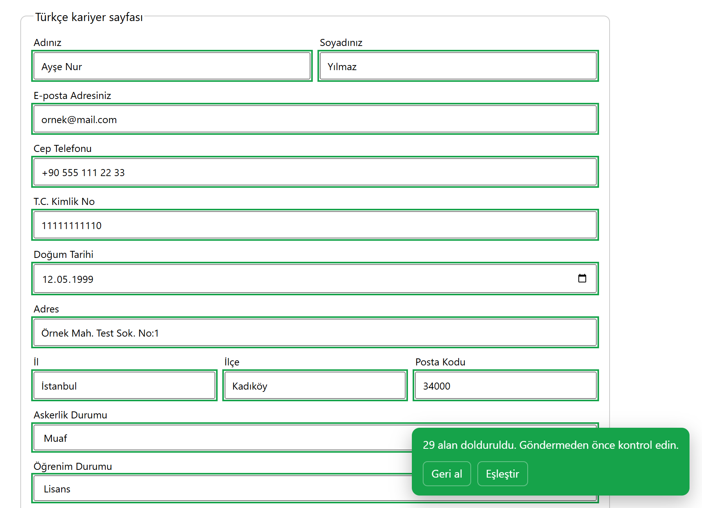
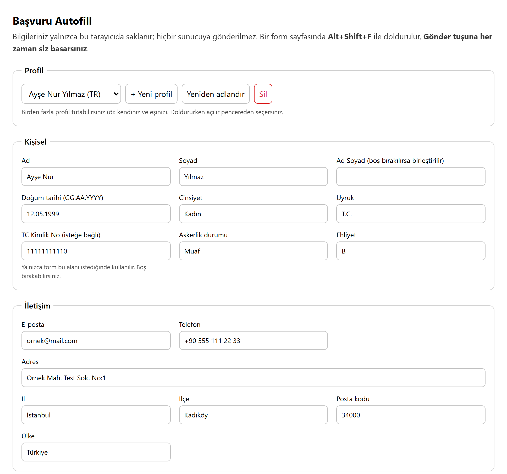
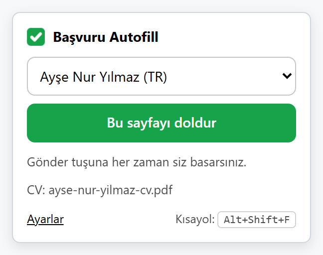
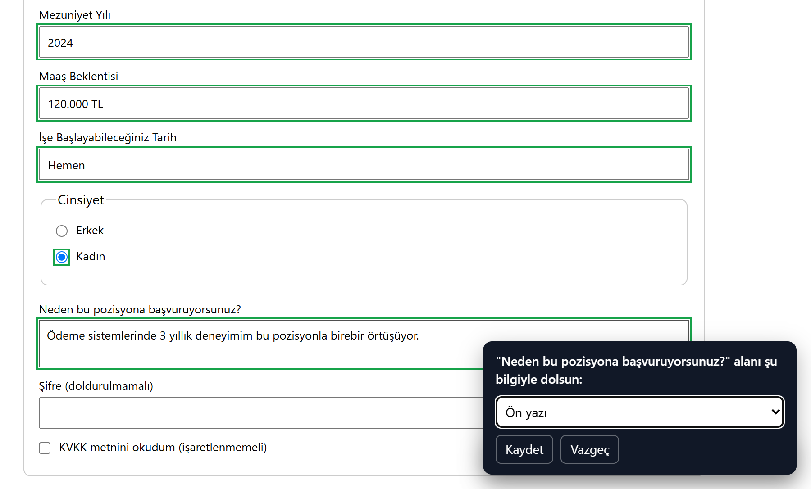
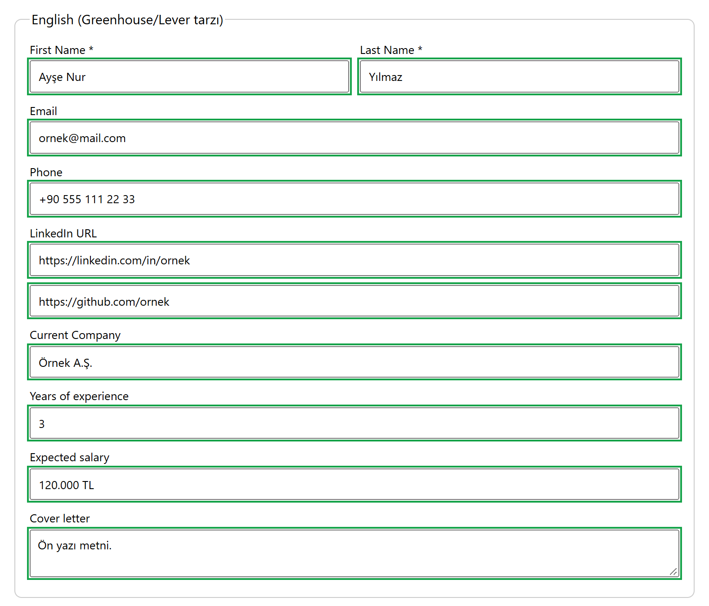
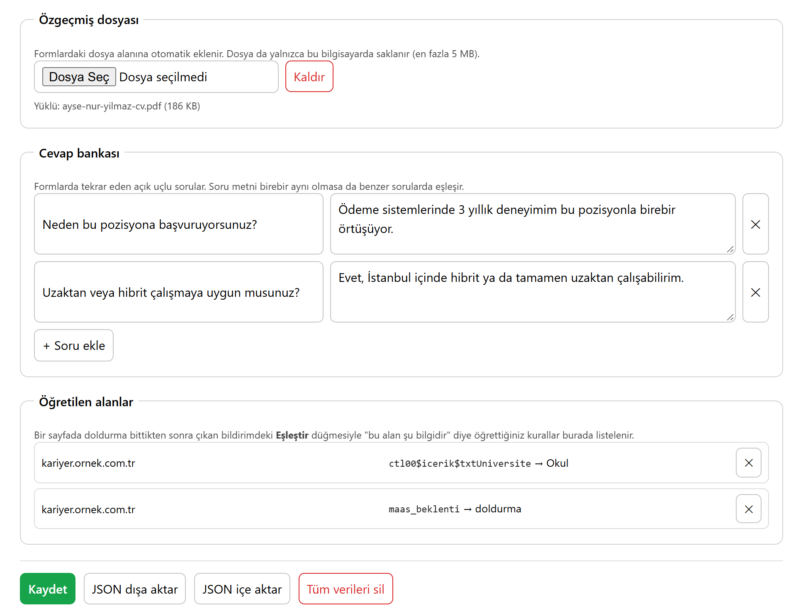
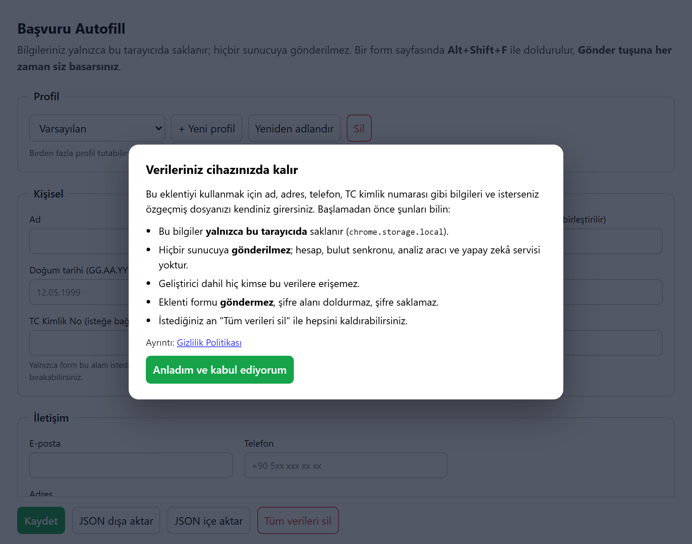
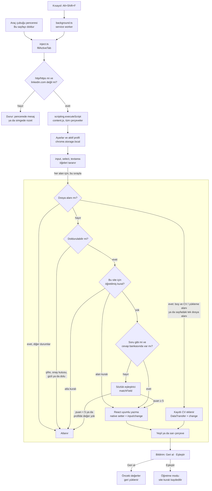

<p align="center">
  
</p>

<h1 align="center">Başvuru Autofill</h1>

<p align="center">
  İş başvurusu ve kayıt formlarını, bir kez kaydettiğiniz bilgilerle tek tuşta dolduran Chrome eklentisi.<br>
  Türkçe ve İngilizce alan etiketlerini tanır. Verileriniz yalnızca kendi tarayıcınızda kalır.<br>
  Gönder düğmesine her zaman siz basarsınız.
</p>

<p align="center">
  <i>English: a privacy-first Chrome extension that fills Turkish and English job-application forms from data stored only on your device.</i><br>
  <a href="#english-summary">English summary ↓</a>
</p>

<p align="center">
  
  
  
  
</p>

<p align="center">
  
  <br>
  <sub><i>Demo formun (<code>test/form.html</code>) Türkçe bölümü, örnek kişi verisiyle tek seferde doldurulduktan sonra. Yeşil çerçeve emin olunan eşleşmedir; emin olunamayan tahminler sarı çerçevelenir (bu örnekte hepsi yeşil). Bildirimdeki sayı, sayfanın görünmeyen kısmını ve İngilizce bölümünü de kapsar. <b>Geri al</b> tüm değişiklikleri geri alır, <b>Eşleştir</b> bir alanı öğretmeyi başlatır.</i></sub>
</p>

**Kısaca**

- **Tek tuş:** formun olduğu sayfada <kbd>Alt</kbd>+<kbd>Shift</kbd>+<kbd>F</kbd> ya da araç çubuğundaki **Bu sayfayı doldur**.
- **Türkiye'ye özgü alanlar:** TC kimlik no, askerlik durumu, il/ilçe, öğrenim durumu, mezuniyet yılı, maaş beklentisi ve diğerleri; toplam 33 profil alanı. Ayrıca CV dosyası ve açık uçlu sorulara hazır cevaplar.
- **Sınırları net:** formu göndermez, şifre alanlarını kendiliğinden doldurmaz, onay kutusu işaretlemez, linkedin.com'da çalışmaz. Sunucu, hesap, analiz aracı ya da yapay zekâ servisi yoktur.

[Nasıl kullanılır](#nasıl-kullanılır) · [Özellikler](#özellikler) · [Gizlilik ve güvenlik](#gizlilik-ve-güvenlik-neyi-yapmaz) · [Mimari](#nasıl-çalışır-mimari) · [Teknik kararlar](#teknik-kararlar) · [Kurulum](#kurulum) · [Test](#test) · [English summary](#english-summary)

---

## Neden?

Türkiye'deki kariyer sayfaları ve kayıt formları her seferinde aynı bilgileri ister: TC kimlik numarası, askerlik durumu, il ve ilçe, öğrenim durumu, mezun olunan okul ve yıl, maaş beklentisi. Her başvuruda bunları baştan yazmak hem zaman alır hem de hataya açıktır.

Tarayıcının yerleşik otomatik doldurması ad, adres, e-posta gibi genel alanlara odaklanır; "T.C. Kimlik No" ya da "Askerlik Durumu" gibi Türkiye'ye özgü alanların bir karşılığı yoktur. Yaygın başvuru doldurucu araçlar ise ağırlıklı olarak İngilizce, ABD odaklı aday takip sistemleri (ATS) için tasarlanır.

Başvuru Autofill bu boşluğu kapatır: bilgilerinizi bir kez girersiniz; eklenti formdaki her alanın etiketini, `placeholder`'ını, `name`/`id` ve `autocomplete` niteliklerini Türkçe + İngilizce bir sözlükle eşleştirip uygun değeri yazar. Formu siz kontrol eder, siz gönderirsiniz.

## Nasıl kullanılır

**1. Bilgilerinizi bir kez girin.** Eklenti kurulduğunda ayarlar sayfası kendiliğinden açılır; ilk açılışta verilerin nerede saklandığını anlatan bir onay ekranı çıkar. Profil bilgilerinizi, isterseniz CV dosyanızı ve sık sorulan sorulara cevaplarınızı girip **Kaydet**'e (ya da <kbd>Ctrl</kbd>+<kbd>S</kbd>) basın.

<p align="center">
  
  <br>
  <sub><i>Ayarlar sayfası, örnek profille. Boş bırakılan alanlardaki gri yazılar yalnızca yer tutucudur.</i></sub>
</p>

**2. Formu doldurun.** Başvuru formunun olduğu sayfada <kbd>Alt</kbd>+<kbd>Shift</kbd>+<kbd>F</kbd> tuşlarına basın ya da araç çubuğundaki simgeden **Bu sayfayı doldur**'a tıklayın. Birden fazla profiliniz varsa (ör. kendiniz ve eşiniz) hangisinin kullanılacağını bu pencereden seçersiniz.

<p align="center">
  
</p>

**3. Kontrol edin.** Doldurulan alanlar 10 saniye boyunca yeşil (emin) ya da sarı (tahmin, kontrol edin) çerçevelenir. Sağ alttaki bildirim 12 saniye açık kalır; kaç alanın doldurulduğunu ve kaçının kontrol beklediğini söyler. Bir şey yanlışsa **Geri al** her alanı önceki haline döndürür. Son kontrolden sonra formu siz gönderirsiniz; eklenti Gönder'e hiçbir zaman basmaz.

**4. Tanımadığı ya da yanlış doldurduğu alanı öğretin.** Bildirimdeki **Eşleştir**'e basın, sayfadaki alana tıklayın ve listeden hangi bilginin yazılacağını seçin (ya da "Bu alanı hiç doldurma"). Kural o site için kaydedilir ve bir sonraki doldurmada cevap bankasından ve sözlükten önce uygulanır. <kbd>Esc</kbd> ile öğretme modundan çıkılır.

<p align="center">
  
  <br>
  <sub><i>Öğretme modu: <b>Eşleştir</b>'den sonra, cevap bankasından zaten doldurulmuş soru alanına tıklandı; sağ alttaki panelde bu alanın profildeki "Ön yazı" bilgisiyle dolması seçiliyor. Tanınmayan bir alana tıklandığında da aynı panel açılır. Cinsiyet grubunda profildeki "Kadın" seçildi; şifre alanı ve KVKK onay kutusu doldurmadan sonra da boş.</i></sub>
</p>

## Özellikler

<p align="center">
  
  <br>
  <sub><i>Aynı profil, İngilizce etiketli (Greenhouse/Lever tarzı) bir formda. Etiketi olmayan alt alan (GitHub) <code>placeholder</code> ve <code>name</code> niteliklerinden tanındı.</i></sub>
</p>

| Özellik | Ne yapar |
|---|---|
| Türkçe + İngilizce alan tanıma | 33 profil alanının her biri için Türkçe ve İngilizce anahtar kelimeler. "Adınız", "T.C. Kimlik No", "Askerlik Durumu" gibi Türkçe etiketler de "First Name", "Years of experience" gibi İngilizce etiketler de aynı profilden dolar. |
| Açılır liste ve radyo düğmeleri | `<select>` seçeneklerini ve radyo gruplarını eş anlamlılarla eşler: profilde "Yapıldı" yazıyorsa listede "Tamamlandı" ya da "Completed" olarak geçen seçenek de eşleşir; "Lisans" "Bachelor" ile de eşleşir. |
| Tarih alanları | `type="date"` alanlarında GG.AA.YYYY biçimindeki tarih YYYY-AA-GG'ye çevrilerek yazılır. |
| Ad / soyad türetme | "Ad Soyad" boşsa ad ve soyad birleştirilir; yalnızca tam ad girildiyse ad ve soyad ondan çıkarılır. |
| Çoklu profil | Birden fazla profil tutulur; doldurmadan önce araç çubuğu penceresinden seçilir. |
| Cevap bankası | "Neden bu pozisyona başvuruyorsunuz?" gibi tekrar eden açık uçlu sorulara hazır cevaplar. Soru metni birebir aynı olmasa da ortak kelime oranıyla eşleşir. |
| CV yükleme | Kayıtlı özgeçmişi (PDF, DOC, DOCX; en fazla 5 MB) boş dosya alanlarına ekler: etiketinde, `name`/`id`'sinde ya da `accept` niteliğinde "CV", "özgeçmiş", "resume" ya da "dosya", "yükle", "upload", "belge" gibi genel bir yükleme ifadesi geçen her alana; sayfada tek dosya alanı varsa ona. |
| Öğretme modu | Tanınmayan ya da yanlış doldurulan alanı bir kez gösterirsiniz; kural sitenin adresi (host) ve alanın `name`/`id` niteliğiyle (yoksa etiketiyle) saklanır, ayarlardan görülüp silinebilir. |
| Geri al | Her alanın önceki değeri doldurmadan önce saklanır; tek tıkla hepsi geri yüklenir. |
| Renkli işaret | Yeşil: emin. Sarı: tahmin, kontrol edin. Doldurulan alanların listesi DevTools konsoluna tablo olarak da yazılır. |
| Mevcut veriye saygı | Önceden doldurulmuş metin alanlarının ve ilk seçenekten farklı bir seçim yapılmış listelerin üzerine yazmaz; gizli, devre dışı ve salt okunur alanları atlar. İstisnalar: radyo gruplarındaki mevcut seçim profil değeriyle değişebilir; dosya alanlarında yalnızca boş olup olmadıklarına bakılır. |
| Gömülü formlar | İsteğe bağlı izinle, başka bir siteden (farklı domain) çerçeve (iframe) içinde gelen formlar da doldurulur. |
| Yedekleme ve silme | JSON olarak dışa/içe aktarma; tek düğmeyle tüm verileri silme. |

<p align="center">
  
  <br>
  <sub><i>Ayarların alt kısmı: kayıtlı CV ("Dosya seçilmedi" yalnızca dosya seçicinin durumudur; kayıtlı dosya altında yazar), cevap bankası, öğretilen site kuralları ve her zaman görünen Kaydet / JSON dışa-içe aktar / Tüm verileri sil çubuğu.</i></sub>
</p>

## Gizlilik ve güvenlik: neyi yapmaz

Eklenti ad, adres ve TC kimlik numarası gibi hassas veriler tutar. Bu yüzden ne yapmadığı, ne yaptığı kadar önemlidir:

| Yapmaz | Neden / nasıl |
|---|---|
| **Veriyi cihazdan çıkarmaz** | Her şey `chrome.storage.local`'da durur. Kodda hiçbir ağ isteği yoktur; sunucu, hesap, analiz aracı, hata raporlama ya da yapay zekâ servisi kullanılmaz. `chrome.storage.sync` de kullanılmaz, yani veriler tarayıcı hesabınızla eşitlenmez. |
| **Sayfalarda kendiliğinden çalışmaz** | Kalıcı `content_scripts` tanımı yoktur. Kod yalnızca kısayolla ya da araç çubuğu penceresindeki düğmeyle, `activeTab` + `scripting.executeScript` üzerinden, o anki sekmeye enjekte edilir. Arka plandaki service worker yalnızca kısayolu ve ilk kurulumu dinler. Tetiklenmediği sürece eklenti gezdiğiniz sayfaları okumaz; kurulumda geniş site erişimi de istemez. |
| **Tüm sitelere izin istemez** | `<all_urls>` yalnızca *isteğe bağlı* bir izindir ve varsayılan olarak kapalıdır. Sadece form başka bir siteden (farklı domain) çerçeve içinde geliyorsa gerekir; ayarlardaki düğmeyle siz açarsınız. |
| **Şifre alanlarını kendiliğinden doldurmaz** | `type="password"` alanlar taramada atlanır; profilde şifre alanı yoktur, eklenti şifre saklamaz. Tek istisna: öğretme modunda bir şifre alanını kendiniz seçip ona bir profil bilgisi atarsanız o bilgi o an alana yazılır; sonraki doldurmalarda alan yine atlanır. |
| **Onay kutusu işaretlemez** | KVKK / açık rıza onayı kullanıcının kendi kararıdır; onay kutuları taramada atlanır. |
| **Formu göndermez, CAPTCHA çözmez** | Eklenti yalnızca alan değerlerini yazar; kodda form gönderme çağrısı yoktur. Gönder düğmesine her zaman siz basarsınız. |
| **linkedin.com'da çalışmaz** | LinkedIn, sitede veri toplayan, sayfanın görünümünü değiştiren ya da işlemleri otomatikleştiren tarayıcı eklentilerine izin vermez; Easy Apply önceki cevapları zaten kendisi hatırlar. Engel domain düzeyindedir (alt domainler dahil): araç çubuğu penceresi açıklama gösterir, kısayolda simgede "LI" rozeti çıkar. |
| **Kodu gizlemez** | Paket minify edilmez ve uzaktan kod indirip çalıştırmaz; mağaza incelemesi ya da herhangi biri dağıtılan kodu okuyabilir. |

İlk açılışta, veri girilmeden önce verilerin nerede ve nasıl saklandığını anlatan bir onay ekranı gösterilir (Chrome Web Store'un hassas veri işleyen eklentilerden istediği belirgin açıklama ve açık rıza şartı). Ekran onaylanana kadar sayfanın önünde kalır:

<p align="center">
  
  <br>
  <sub><i>İlk açılıştaki onay ekranı.</i></sub>
</p>

Ayrıntılar için: [Gizlilik Politikası (PRIVACY.md)](PRIVACY.md).

## Nasıl çalışır (mimari)



**Akış özeti.** Kısayolu `background.ts` (service worker), araç çubuğu düğmesini `popup.ts` yakalar; ikisi de `core/inject.ts`'teki aynı fonksiyonu çağırır. Bu fonksiyon yalnızca `http`/`https` adresli sekmelerde ve linkedin.com dışında `content.js`'i tüm çerçevelere enjekte eder; bu başarısız olursa yalnızca ana çerçeveyi dener. İçerik betiği her çerçevede ayrı çalışır: ayarları okur, o çerçevedeki alanları sırayla dolaşır, her alan için yukarıdaki öncelik sırasını uygular ve en sonda kendi bildirimini gösterir.

### Alan tanıma

Etiket sayfadan okunduktan sonra eşleştirmenin tamamı (`src/core/matcher.ts`, `dictionary.ts`, `normalize.ts`) DOM'a ve Chrome API'lerine dokunmayan saf fonksiyonlarla yapılır.

1. **Etiket bulma** (`fill.ts`). Alanın etiketi sırasıyla `input.labels`, `label[for=id]`, alanı saran `<label>`, `aria-labelledby` ve son çare olarak üst kapsayıcının kısa metninden (160 karakterden kısa; Greenhouse/Lever bu yapıyı kullanır) okunur.
2. **Normalleştirme.** Metin küçük harfe çevrilir, Türkçe karakterler sadeleştirilir (İ/I/ı → i, ş → s, ğ → g, ü → u, ö → o, ç → c), harf ve rakam dışındaki her şey boşluğa dönüşür: `"Doğum Tarihi*"` → `"dogum tarihi"`.
3. **Kelime sınırı.** 4 karakter ve daha kısa anahtar kelimeler ile boşluk içerenler yalnızca tam kelime olarak eşleşir; böylece "ad" "adres"in, "il" "ilçe"nin içinde yakalanmaz. Daha uzun tek kelimeler alt dize olarak da eşleşir ("Cep telefonunuz" → `telefon`).
4. **Negatif anahtar kelimeler.** Yanlış eşleşmeye açık alanların bir "içermemeli" listesi vardır; bu kelimelerden biri herhangi bir sinyalde geçerse o alan elenir: "Kullanıcı Adı" ya da "Referans Kişi Adı" ad alanına yazılmaz, "Şirket Adı" şirket alanına gider, "Ülke Kodu" ülke sayılmaz.
5. **Puanlama.** Puan = anahtar kelime uzunluğu × sinyal ağırlığı. Bir sinyalin tamamı anahtar kelimeye eşitse (ör. etiket yalnızca "İl" ise) +10 eklenir. En yüksek puan kazanır; bu da en spesifik (en uzun) eşleşmenin seçilmesi demektir.

   | Sinyal | Ağırlık |
   |---|---|
   | Etiket metni | 3 |
   | `aria-label` | 2,5 |
   | `placeholder` | 2 |
   | `name` + `id` (tek sinyalde birleşik) | 1,5 |

6. **Eşikler.** Puan 5'in altındaysa alan doldurulmaz; 5 ile 12 arasındaysa (12 hariç) doldurulur ama sarı işaretlenir; 12 ve üzeri yeşildir.

   | Örnek | Eşleşen | Hesap | Sonuç |
   |---|---|---|---|
   | Etiket "Cep Telefonu" | `cep telefonu` | 12 × 3 + 10 = 46 | yeşil |
   | Etiket "İl" | `il` | 2 × 3 + 10 = 16 | yeşil |
   | Etiket "Yaşadığınız il" | `il` | 2 × 3 = 6 | sarı |

7. **`autocomplete` önceliği.** Alan standart bir `autocomplete` değeri taşıyorsa (`given-name`, `family-name`, `email`, `tel`, `postal-code`, `bday` vb.) sözlüğe bakılmadan doğrudan eşlenir (puan 100).
8. **Seçenek eşleme.** `<select>` seçenekleri ve radyo düğmesi etiketleri aynı saf fonksiyonla (`pickOption`) eşlenir: profil değeri ve eş anlamlıları önce seçenek metinleriyle birebir karşılaştırılır, sonra kelime bazında aranır. Kısa eş anlamlılar yalnızca tam kelime olarak eşleşir; böylece "k" "Erkek"in, "male" "Female"ın içinde yakalanmaz. `<select>`'te metinle eşleşme yoksa seçeneklerin `value` değerlerine bakılır. Her radyo grubu bir kez işlenir ve çerçeve seçilen düğmeye konur.
9. **Cevap bankası.** Soru gibi görünen alanlar (`textarea`, `?` içeren ya da 40 karakterden uzun metin) önce cevap bankasında aranır. Benzerlik, 2 karakterden uzun ortak kelime sayısının kısa olan metnin kelime sayısına oranıdır: 0,5 ve üzeri doldurulur, 0,75 ve üzeri yeşil işaretlenir.

## Teknik kararlar

- **Kalıcı content script yerine anlık enjeksiyon.** `activeTab` + `scripting.executeScript` ile kod yalnızca kullanıcı tetiklediğinde ve yalnızca o sekmede çalışır; kurulumda geniş site izni gerekmez. Bunun bedeli: çok adımlı formlarda her adımda yeniden tetiklemek gerekir.
- **React / Angular uyumlu yazma.** Kontrollü bileşenler `el.value = x` atamasını görmez. Değer, prototipteki native `value` setter'ı ile yazılır, ardından `input`, `change` ve `blur` olayları tetiklenir (`src/core/fill.ts`).
- **Dosya alanına CV.** `FileList` doğrudan oluşturulamadığı için kayıtlı base64 veriden bir `File` üretilir, `DataTransfer` ile `input.files`'a verilir ve `change` olayı tetiklenir.
- **Shadow DOM içinde arayüz.** Her bildirim ve öğretme paneli, sayfaya eklenen kendi kapsayıcısının açık (`mode: 'open'`) shadow root'unda, en yüksek `z-index` ile çizilir. Sayfanın CSS kuralları panellerin içine işlemez; kök açık olduğu için otomatik testlerden de erişilebilir.
- **Saf ve test edilebilir çekirdek.** Eşleştirici DOM'a ve `chrome.*` API'lerine bağlı değildir; `npm run check` onu esbuild ile Node için paketleyip doğrudan çalıştırır. Sözlükteki her değişiklik bu komutla 72 alan tanıma ve 12 seçenek eşleme vakasına karşı saniyeler içinde sınanır.
- **Tip güvenliği sözlükte de.** `FIELD_DEFS` ve `FIELD_LABELS` `Record<ProfileKey, …>` tipindedir: yeni bir profil alanı eklenip sözlüğe ya da etiket listesine eklenmesi unutulursa `npm run typecheck` (tsc) hata verir; esbuild derlemesi tip denetimi yapmaz. TypeScript `strict` modda.
- **Sürümlü ayar şeması.** `Settings` bir `version` alanı taşır; tek profilli v1 verisi ilk yüklemede adlandırılmış profillere (v2) taşınır, eksik alanlar boş profille birleştirilir. Yeni alan eklemek eski kullanıcı verisini bozmaz.
- **Çalışma zamanı bağımlılığı yok.** `package.json`'da `dependencies` yoktur; yalnızca geliştirme araçları (esbuild, TypeScript, `@types/chrome`). Dört giriş noktası esbuild ile ayrı IIFE paketlerine derlenir ve minify edilmez. Simgeler bile bağımlılıksız küçük bir PNG kodlayıcıyla üretilir (`tools/make-icons.mjs`).

## Proje yapısı

<details>
<summary>Dosya ağacı</summary>

```
basvuru-autofill/
├── public/                    dist/'e olduğu gibi kopyalanan dosyalar
│   ├── manifest.json          MV3 manifesti: izinler, kısayol, en düşük Chrome sürümü
│   ├── popup.html             araç çubuğu penceresi
│   ├── options.html           ayarlar sayfası ve ilk açılış onay ekranı
│   ├── _locales/{tr,en}/      eklenti adı ve açıklaması (varsayılan dil: tr)
│   └── icons/                 16, 32, 48 ve 128 px simgeler
├── src/
│   ├── background.ts          service worker: kısayol, ilk kurulumda ayarlar, hata rozeti
│   ├── popup.ts               profil seçimi, "Bu sayfayı doldur", sonuç mesajı
│   ├── options.ts             profiller, cevap bankası, CV, kurallar, yedekleme, izin
│   ├── content.ts             sekmeye enjekte edilen betik: tarama, doldurma, işaretleme,
│   │                          bildirim, geri alma, öğretme modu
│   └── core/
│       ├── dictionary.ts      TR + EN alan sözlüğü, autocomplete eşlemesi, CV kelimeleri
│       ├── matcher.ts         sinyal ağırlıkları, puanlama, eşikler, seçenek eşleme
│       ├── normalize.ts       Türkçe karakter sadeleştirme, kelime sınırı, benzerlik
│       ├── fill.ts            React uyumlu yazma, select/radio doldurma, etiket bulma
│       ├── inject.ts          aktif sekmeye enjeksiyon, linkedin.com engeli
│       └── types.ts           profil şeması (33 alan), ayar yükleme/kaydetme, v1 → v2
├── test/
│   ├── check.ts               alan tanıma ve seçenek eşleme testleri (npm run check)
│   └── form.html              demo başvuru formu: TR ve EN bölüm, şifre ve KVKK tuzakları
├── tools/
│   ├── make-icons.mjs         bağımlılıksız PNG simge üretici
│   └── promo/tile.html        mağaza tanıtım görselinin HTML kaynağı
├── store-assets/              mağaza tanıtım görseli (440×280)
├── docs/images/               README ekran görüntüleri
├── build.mjs                  esbuild derleme betiği
├── package.json               npm betikleri ve geliştirme bağımlılıkları
├── tsconfig.json              TypeScript ayarları (strict)
├── PRIVACY.md                 gizlilik politikası (TR + EN)
└── STORE.md                   Web Store yayın dosyası: mağaza metinleri, izin gerekçeleri
```

</details>

`dist/` derleme çıktısıdır ve depoda tutulmaz.

## Kurulum

Gereken: Node.js (npm ile) ve Chrome 116 ya da üzeri.

```bash
git clone https://github.com/murat6312/basvuru-autofill.git
cd basvuru-autofill
npm install
npm run build
```

Chrome'da `chrome://extensions` → **Geliştirici modu**nu açın → **Paketlenmemiş öğe yükle** → `dist` klasörünü seçin. İlk kurulumda ayarlar sayfası açılır. Kısayolu değiştirmek için: `chrome://extensions/shortcuts`.

## Geliştirme

| Komut | Ne yapar |
|---|---|
| `npm run build` | `public/`'i `dist/`'e kopyalar, `src/` altındaki dört giriş noktasını esbuild ile paketler. |
| `npm run dev` | esbuild izleme modu: `src/` değiştikçe `dist/` güncellenir. `public/` değişirse yeniden `npm run build` gerekir. |
| `npm run typecheck` | `tsc --noEmit` ile tip denetimi. |
| `npm run check` | Alan tanıma testlerini çalıştırır (aşağıda). |
| `npm run icons` | `public/icons/` altındaki simgeleri yeniden üretir. |
| `npm run package` | Derler ve `dist/` içeriğini mağazaya yüklenecek `basvuru-autofill.zip` dosyasına sıkıştırır (PowerShell `Compress-Archive` kullandığı için Windows'ta çalışır). |

Kod değiştikten sonra `chrome://extensions` sayfasında eklentiyi yenileyin.

## Test

**Alan tanıma testleri.** `npm run check`, eşleştiriciyi gerçek başvuru formlarından (Lever, Greenhouse, Workday ve Türkçe kariyer sayfaları) derlenmiş 72 vakayla sınar: 26 İngilizce ATS etiketi, 32 Türkçe kariyer sayfası etiketi, etiketsiz alanlar için 8 nitelik sinyali (`name`, `autocomplete`, `placeholder`) ve yanlış eşleşmeyi yakalamak için 6 tuzak etiket ("Kullanıcı Adı" ad değildir, "Ülke Kodu" ülke değildir). Aynı komut 12 seçenek eşleme vakasını da çalıştırır: açılır liste ve radyo seçeneklerinde eş anlamlıların doğru seçeneği bulduğunu, kısa eş anlamlıların başka seçeneğin içinde yakalanmadığını doğrular (profilde "Kadın" varken "Erkek", "Erkek" varken "Female" seçilmez). Başarısız vakalar ayrıntısıyla listelenir ve komut hata koduyla çıkar.

```
$ npm run check
Alan tanima: 72/72 dogru
Secenek esleme: 12/12 dogru
```

**Demo form.** `test/form.html`, İngilizce (Greenhouse/Lever tarzı) ve Türkçe iki bölümden oluşan örnek bir başvuru formudur; doldurulmaması gereken bir şifre alanı ve bir KVKK onay kutusu da içerir.

- *Eklentiyi kurmadan:* önce `npm run build`, sonra `test/form.html` dosyasını tarayıcıda açıp **Demo veriyle doldur** düğmesine basın. Sayfa `window.chrome`'u örnek verili sahte bir depoyla taklit eder ve gerçek `../dist/content.js` betiğini yükler; yani eklentideki doldurma mantığının aynısı çalışır. Adrese `?auto=1` eklenirse düğmeye kendiliğinden basılır.
- *Kurulu eklentiyle:* eklenti yalnızca `http`/`https` sayfalarında çalıştığı için sayfayı yerel bir sunucudan açın (örneğin proje kökünde `npx http-server . -p 8080`, ardından `http://localhost:8080/test/form.html`) ve <kbd>Alt</kbd>+<kbd>Shift</kbd>+<kbd>F</kbd>'ye basın.

## Bilinen sınırlar

- Yalnızca gerçek `input`, `select` ve `textarea` öğeleri doldurulur. Workday tarzı özel açılır listeler ve web bileşenlerinin shadow DOM'u içindeki alanlar desteklenmez.
- Başka bir siteden (farklı domain) çerçeve içinde gelen formlar için ayarlardan "Tüm sitelerde çerçeve desteğini aç" izninin verilmesi gerekir; izin yoksa yalnızca ana çerçeve doldurulur.
- Çok adımlı formlarda ve sonradan beliren alanlarda kısayola yeniden basmak gerekir.
- CV, etiketinde "dosya", "yükle", "belge" gibi genel ifadeler geçen fotoğraf ya da diploma gibi başka yükleme alanlarına da eklenebilir; dosya alanlarında görünürlük ve devre dışı denetimi de yapılmaz. Göndermeden önce dosya alanlarını kontrol edin.
- Cevap bankası anlamsal değil, kelime örtüşmesine dayanır; çok farklı ifade edilmiş soruları kaçırabilir.
- Tarih dönüşümü yalnızca GG.AA.YYYY (ayırıcı `.`, `/` ya da `-`) biçimini tanır.
- Veriler `chrome.storage.local`'da şifrelenmeden durur; diskte yalnızca işletim sistemi kullanıcı hesabının dosya izinleriyle korunur. Ortak kullanılan bir bilgisayarda dikkatli olun.

## Durum

- **Sürüm 0.2.0.** Mağaza metinleri (TR/EN), izin gerekçeleri, gizlilik beyanları ve olası ret sebepleri tablosu [STORE.md](STORE.md)'de hazır; mağaza ekran görüntüleri (1280×800) ve hesap/yayın adımları henüz tamamlanmadı. Mağazada yayımlanana kadar eklenti yukarıdaki gibi geliştirici modunda kurulur.
- **Kapsam bilinçli olarak tek amaçlı:** form doldurma. CV yazma ya da başvuru takibi gibi modüller Chrome Web Store'un tek amaç politikası gereği ayrı amaç sayıldığından bu eklentinin kapsamı dışında tutulur.

---

## English summary

**Başvuru Autofill** (Turkish for "application autofill") is a Chrome extension (Manifest V3, strict TypeScript) that fills job-application and sign-up forms from a profile you save once. It is built for Turkish forms, recognising labels such as *T.C. Kimlik No* (national ID number), *Askerlik Durumu* (military service status), *İl / İlçe* (province / district) and *Öğrenim Durumu* (education level), and it handles English ATS-style forms (Greenhouse/Lever-like labels) from the same profile.

**Screenshots.** The images above are captioned in Turkish. The top image is the Turkish part of the bundled demo form (`test/form.html`) after one fill: green outlines mark confident matches, and the toast reads "29 alan dolduruldu. Göndermeden önce kontrol edin." ("29 fields filled. Check before submitting."; the count covers the whole page) with **Geri al** (Undo) and **Eşleştir** (Teach a field). Further down: the settings page, the toolbar popup (**Bu sayfayı doldur** = Fill this page), the teach-mode field picker, the same profile filling an English Greenhouse/Lever-style form, the lower part of the settings page (CV, answer bank, taught rules) and the first-run consent screen.

**Why.** Turkish application forms ask for the same locale-specific details every time. Browser autofill focuses on generic fields such as name, address and e-mail, and common autofill tools are built mostly around English, US-centric applicant tracking systems, so these labels usually go unrecognised.

**What it does.** 33 profile fields; multiple profiles; an answer bank for recurring open questions (word-overlap matching); CV upload into empty file inputs (those whose label or attributes look like a CV or generic upload field, or the page's only file input); `<select>` and radio matching with synonyms ("Yapıldı" also matches "Completed"); `DD.MM.YYYY` → ISO conversion for date inputs; green / amber outlines for confident / guessed matches; one-click undo; and a teach mode that saves per-site field rules for fields it does not recognise or fills wrongly.

**How it works.**

- **Trigger.** No code runs in any page until the user presses <kbd>Alt</kbd>+<kbd>Shift</kbd>+<kbd>F</kbd> or clicks "Bu sayfayı doldur" in the toolbar popup; the service worker (or popup) then injects `content.js` into the active tab via `activeTab` + `scripting.executeScript`. There are no persistent content scripts.
- **Per field, in order:** CV for file inputs → a taught per-site rule → the answer bank for question-like fields → the dictionary matcher.
- **Matcher.** Folds Turkish characters, requires whole-word hits for short keywords, applies per-field negative keywords, and scores *keyword length × signal weight* (label 3, `aria-label` 2.5, `placeholder` 2, `name`/`id` 1.5), +10 when the whole signal equals the keyword; standard `autocomplete` values map directly. ≥ 12 → filled, green; 5 to < 12 → filled, amber; < 5 → ignored.
- **Writing and UI.** Values go through the native value setter plus `input`/`change` events so React/Angular inputs pick them up; the toast and teach panel live in open shadow roots so page CSS does not leak into them.

**Privacy and limits by design.** Data stays in `chrome.storage.local` only: no server, account, analytics, AI service or network requests, and no `chrome.storage.sync`. It never fills password fields on its own (teach mode writes into one only if the user explicitly picks it), never ticks checkboxes, never submits a form and never runs on linkedin.com (whose rules prohibit browser extensions that scrape, modify the appearance of, or automate activity on the site). `<all_urls>` is an optional permission, off by default, requested only for cross-origin iframes. The bundle is not minified. The first run shows an explicit consent screen. See [PRIVACY.md](PRIVACY.md) (Turkish and English).

**Known limits.** Only real `input` / `select` / `textarea` elements are filled (no custom dropdowns or web-component shadow DOM); multi-step forms need re-triggering; the CV can also land in other upload fields such as a photo or diploma input; data in `chrome.storage.local` is not encrypted.

**Build and test.** `npm install && npm run build`, then load `dist/` as an unpacked extension (Chrome 116+). `npm run check` runs 72 label-recognition cases (English ATS labels, Turkish labels, attribute-only signals and false-positive traps) and 12 option-matching cases for selects and radio groups; `npm run typecheck` runs `tsc`. `test/form.html` is a demo form that runs the real content script with a stubbed `chrome` API. There are no runtime dependencies; the toolchain is esbuild and TypeScript.

**Status.** Version 0.2.0. Store listing texts (Turkish and English), permission justifications and privacy declarations are prepared in [STORE.md](STORE.md); store screenshots (1280×800) and account steps are pending. Until it is published, install it in developer mode.
